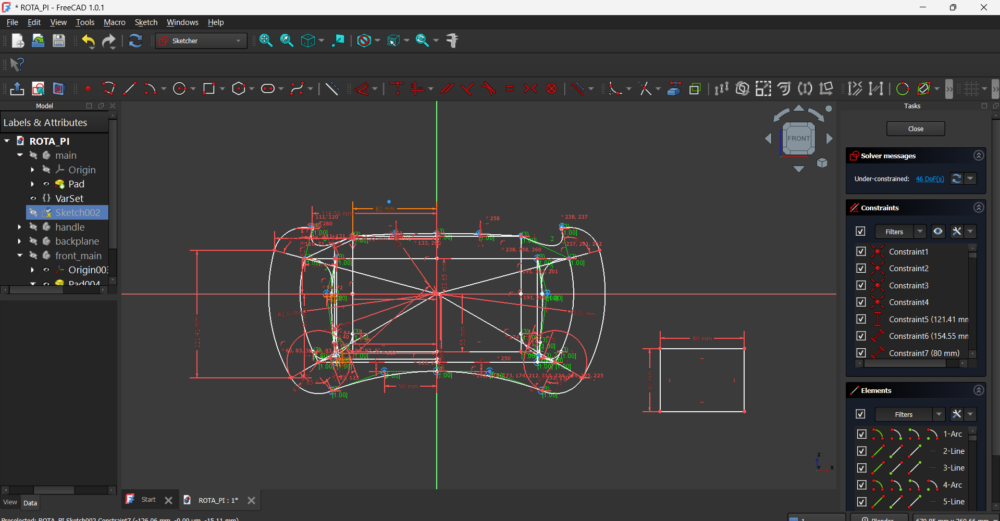
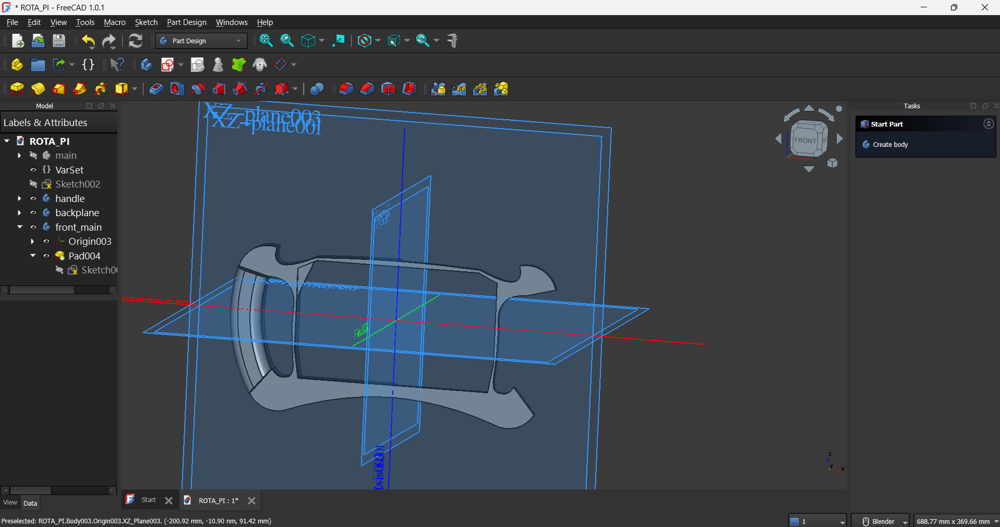

# June 3th: Finish the first version schematics for the PCB!!

I started the project by making the schematics first via KiCAD, a free open sources CAD editor for broke guy like me. I planning to use Pico because i dont know why, I already made some project using ESP nor Arduino so that why i want to step into the red side. The first problem I encountered is that the joystick need 4 ACD or analog pin while the Pico only had 3, so i use a module named ADS1115 that combine 4 analog pin into I2C that could be used in the Pico. Oh well, this is my first time building PCB so i hope its not going to explode anytime soon

hmm i hope it could be seen!

**Total time spent: 3H**

# June 11th: Welp, Change alot

Before I started the documentation, I just wanna say that lately im very busy, so i just like use like 20 to 30 minute a day for this project and I documented when its big cahnges.

Ok the first change to this project is that the begining plan is to use 2 jostick for throttle and brake, but i found it wierd and hard to control so i changed to hall sensor using button with spring. The other changes is the use of rotary potentiometer instead of fanct AS5600 magnetic anglular sensor, because It require 2 PCBs for the AS5600 to work properly in this project cases.

So yeah, i Got alot works on the KICAD stuff. But its roughly looks like this:

I'll ask for recomendation and further tuning in teh Slack or other group. But for now its fine adn I already test teh ERC or Electrical Ruler Checker built in on KiCad. The next problem is to find the proper footprint for this schematics, Because i coulndt find the module that i intended too, it just far off.

**Total time spent: 3H**

# June 19th: PCB togo!!!

To start with, I change a bit off the way to control the trottle and braking system, instead of using thumb conroled linear sensor via hall sensor magnet, i use like angular like spring place behind the wheel instead, so the breaking and throttle more like how supercar change its gear (placement).

One of the hardest thing is to find the right footprint fot this pproject, and this is one of a big task. But i cahnge that idea to instead used wire pin on the PCB, so i can just use the wire to connect the component. Othertahn to cut cost its also bbecause im still preatty unsure where to put the stuff (eg. button, rotary stuff, exc). So I got going, make the PCB stuf on Kicad, get wiring, placement, and other. Until i met a problem, theres error that one part of the board cant get the GND pin (note: i set the pad to be gnd) becaise its isolated by the copper wire, i need to tweek really hard and rerouting the wire so that, all area is connected to the rest of the area. I forget to picture at that problem but hey heres the fixed version:

Also I had a few time left adn i used that to find the datasheet, dimesion, and other info of the thing i want to use so that it fit perfectly fine. I start by searching free 3D model in GrabCAD adn thankfully, i found all of the thing i needed. I also list what i need to buy for this project likee this:

In the next part i want to start 3D designing. hope itll be fun!

**Total time spent: 4H**

# June 21th: 3D menace

For this project, I decided to use FreeCAD instead of other free CAD software like Fusion 360, because I actually dont know good free cad software until I read the recomended thing in highway website (whhich recomedn to use fusion360) and by that time, i already learn freecad. But oh well, it cant be that bad right??

Well.... As for the last hour i just tweeks all of my brain celll about how to like change the position of a pad in 3d wihtout cahnging the sketch, theres a built in setting called "placement", but it didnt update the real pad position, i try following countless YT videos and endless reddid post, and found no hope until i found this post:
https://www.reddit.com/r/FreeCAD/comments/1ht0gcg/in_freecad_10_i_cant_adjust_position_of_a_sketch/

And theres a person said this "Edit attachment, not placement. ". So wait, i check it but like where do the attachement option is????. until countless time afterward i found it but in the properties setting of the pad. And i click the edit button from the attachment part and it show similar tab like my initial placement setting, but the different is that its works. yayyyyyyyyyyyyyyyyyyyyyyyyyyyyyyyyyyyyyyyyyyyyyyyyyyyyyyyyyyyyyyyyyyyyyyyyyyyyyyyyyyyyyyyyyyyyyyyyyyyyyyyyyyyyyyy

And this is bc in Freecad, when we tweeks the placement, its like moving the whole goddam thing like what its sitting on and waht its link too also move, and this create error and bc of that,  freecad disalow this setting. The right way is to change via attachment, or just change this and other think will adapt to it, and this is fine. But why dotn Freecad tells me this? (maybe i should have been using Fusion360 instead this whole time)

So other than this problem the infamous "wire is not closed" error is haunted me for hours, but its not as bad as that one. So heres is where i left on today:

**Total time spent: 6H**

# June 26th: re-doing

So i just did some things like planning the button placement, making the non finish rear part, and basically the structure. Until a time i notice that my handle are too small, its not about my calculation but its about the handle structure that make lots of part of the handle into the cap of the wheel. Thankfully i notice it before building the screww and detailing stuff, but it still suck to redo almost all part of it, its not that much actually. BUT...... i face error, bc i change a part of a sketch, the other part that are linked to it became error, and welp, almost 30 error is showned when i doing sometihing (freecad will always tell the error everytime the user do thign, eventho its not related). 

I fix it, its preatty easy cux freecad tools me what part of it. BUT............ theres a part where in the sketch its included but the pad of it its not,u can see the image below teh one in the green line. So what happen is that when i update the part of the handle, the updated part is working but the old one (which is the top part ) not showing eventho i dont doo anything to it. I just furious and i almost crashout (chatgpt also). chatgpt told me that it maybe bc theres some line that arent connected, but if there is there must be the "wire not closed" error, which there aren't, he said to chechk the sketch using sketch validate tools, but i try em, and it show all fine. and at last resoult i try remaking the top part, and it works, guess when finding a bug is better to make it from scratch rather than fixing it, not bc im lazy it just bc the software is bugging (nah this man is escussing)

oh almost forget, the handle update i mention earlier is the bottom part here:

**Total time spent: 6H**

# June 27th - July 11th: finishing

So actually, for the last 2 weeks or so, I grind for this project every night (cuz morning i sleep) and i always forget and lazy to document it so i just yeet em up and dumb into one for here. SO where could i start? so i finish the design, screwing,  mounting, wrote the BOM, and much more. Here a picture of it:

I also make and finish lots of chechlish taht i made on Notion so i could keep track what todo. I also hear that Tokopedia (an Indonesia online marketplace) support HCB directly, but im not sure if its true or not. Anyways now for the problem that i encountered in this session, which is the way that Freecad boolean ccut works.

In short what is boolean cut is, its a tools to delete a part of a body according to other body. But here's the confusing part, theres 2 way todo it in FreeCAD, either via part design workbench or part workbench (it just some edit mode in freecad in short). The differents is that in part workbench, when i make the boolean it create new body taht combine both of the old body into one cutted body. But for the part design workbench, instead creating new body it just edit the first body and cut it according the second body, but the part desing workbench method is more prone to error cuz editing tend to cause some dependesies problem  (like im here). 

So why did i wanna achive in the bollean cut in the first place? so i wanna make a hole for the screw acros some bodies, theres the manual works which is meh and easily messed up when editing so i use boolean by creating a tube like body and cut acros those body. The first problem is that boolean dont actually works, theres no error but theres no result either (maybe i stick to fusion instead this whoole time) but i fixed the issues, with the help of media and 3 y/o forum, the intended methos is to use the sub-binder tools so taht its more stable and less prone to error. So sub-binder it just a way to replicate a body into another body taht u can use for various things like boolead cut, bc its a copy it had less dependency with other part so it had less chance to error. So i try it, adn it works for the first part, but when i wanna cut to the other body it just cant work. After countless hours pass, i found some possible fixes, the first is to turn on the "allow compound" option in the body i wanna cut, thiss allow that body to have multiple seperate part. Other tahn that, in the sub-binder part theres option to turn of all the dependency and the things that rely on it, and yay its works for all of the body and part of the screw i wanna put. If my brain its right, this happen around 1-3th july and as u may guest it cost alot of hours, maybe 15 or so.

The other error i encountered is the DAG error, which in short mean that theres something that make a circular dependency. For example sketch A is depend of B origin (like B's coordinate relative), C is the pad that ocupise the sketch A, but origin B places depend of the one face in the pad of pad C, so Freecad just freek out and ded, theres some way to found the DAG (bcus they didnt mention where the DAG is on the debug (another reason to chagne to fusion), but i remember a way to make the debug said it but i forget and cant find the way in the forum nor freecad webs), first is using the "dependency graph" feature built in the Freecad, its just a Graphviz integrated to built like flowcart of dependency of your project, the other way is to use a hidden unintended (according to the freecad wikis idk why) tools called the "DAG view", which u just turn one by tweeking some setting, which does the works like the first option but it more clean but less intuitive about the graph.

But................ my project litteraly had so much thingy in there its almost impossible to found the circular dependency error part. Both the first and second way are useless, so what i did is, just re doing the screw thingy  (which cost heavely hours) and it show no error this time, yipe. casual coding fix. For this error, this happen more or less on the 5th or the 6th of july, and it cost me around 8 hours i think?

Now for the fillet error, so in short fillet is really sensitive here, one wwrong move and theres floating rectengle out of nowhere. But aslong as u follow the intended way it works (mostly), theres no actually intended way, but like some way to prevent anomalies for hapening, like making sure the angle between line is tangent or not using mulitiple arch at one (used b spline insteaad), this is the hard part bcuz at some part theres no fix to this, so i just tweeks and hop no one saw some anomalise, like this part: (its part of the handle)

this it the best i could do, it cut a lot of imagination that i wanna make but oh well. This one happen lately (june 11th), but its a quik fixs (i mean just ignore it).

Now for the hard part, the paddle part. This part need really precise measurment, bc one wrong angle/distance and the whole thing may not reach my finger. Oh, i also planing to use index finger to use the paddle, its more like how supercar change geers (like some mclaren). Also i need to precisely measure the distance of the magnet to the hall sensor magnet between the max and min value of the paddle, and let say i had difficult time finding the right place for the magnet and sensor, i initialy plan to put both of em inside the case via extenting the paddle into the cap, but i dont think that necessary, so i just put it outside, its looks awful but hey, who look at back anyways? I already did the outline of the paddle part before this session, but i made the detail at this session. For this one, its around 8th or i think its 9th july (cuz 7th july i was busy), and it cost around 15 hours or so.

The last issues i encountered is how to make the wheel stay still of the table, i initialy wanna use some kind of metal clamp, but i found a really good model of 3d printed clamp. I use the 3d printed one bc i could tweek a bit so it looks more contrast to the wheel. So the issues was that the 3d file i found of the clamp is .stl instead of .step, so i need to change from a mest (.stl) into a .step that can be edited easily, but let say that its not making a good .step replica. BC .stl is just a billion triangle, converting to .step could mean still inherid does billion triangle, it make it so lagy and hard to edit as a whole (bc u need to edit each individual traingle faces). Thankfully theres a feature in FreeCAD to simplify the body, so i use this andd..... nothing happen, it still a billion trianggle, so i try using the "convert into body" feature, which just turn it into body not change anything, but idk why when i did this i could simplify the body and make it way simple than before.
From this:

into this:

This one is at the 10th and continue at 11th july, it uses around 8 hours or so.

I think this is all the error and issues i encountered, other than that maybe the small error like wire not closed or just freecad freak out about the UI. Speaking of the UI, i tweek the setting abit now my FreeCAD looks georgoues, its not like 20 y/o app built for war anymore. Its looks like this:

I think its finish, i plan to use the 350$ grant so i need to present (more or less) to pitstop, hopefully i could get lots of support. Also i did lots of other things like finding the deal in marketplace, serching for best 3d printing and PCB service localy (cuz Indonesia where i live from cant get things from china for some reason), and i already got and eye into some places and already asking about the service detail.

**Total time spent: 40h**

# July 12th: emmm still finishing
I finaly round down my option for my 3d printing service i wanna use, its called Filamen (u can seach filamen.com/id) (the reason i no). I face a problem, their machine only support 250mmx250mmx250mm, but my wheel width is around 300mm ish, so i plan to cut in half and use screw to joint em. So i made extra pad for the screw to joint, somehow somewhy it didnt works, i just do literaly the thing i had done a billion time and this one error for no aperent reason.

So the error said that (in short) the pads i made is not intercepting the whole body, oh boy where do i start? First i use external link which in short is just a link to the body so its no way that it missed, second i already use "allow compund" option in that body, so freecad allow multiple part in that body. After fw hours searching forum i gave up, i just ask teh forum rn and waiting for the reply.

THankfully, from filamen service, they provided free 3d design consultation, so hopefully they could fix this  with they fancy premium app. 

Also i did some lil design change, like adding chamfer/fillet in the rear and do some tidy stuff.

And i hope i could fix taht error today (cuz its 3 am rn) and could finaly pitch to the pitstop.
**Total time spent: 6H**

