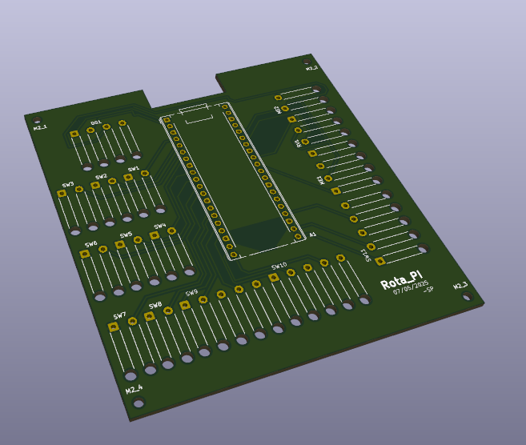

# June 3th: Finish the first version schematics for the PCB!!

I started the project by making the schematics first via KiCAD, a free open sources CAD editor for broke guy like me. I planning to use Pico because i dont know why, I already made some project using ESP nor Arduino so that why i want to step into the red side. The first problem I encountered is that the joystick need 4 ACD or analog pin while the Pico only had 3, so i use a module named ADS1115 that combine 4 analog pin into I2C that could be used in the Pico. Oh well, this is my first time building PCB so i hope its not going to explode anytime soon

hmm i hope it could be seen!

**Total time spent: 3**