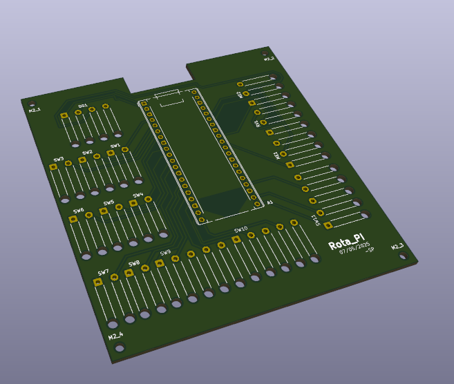
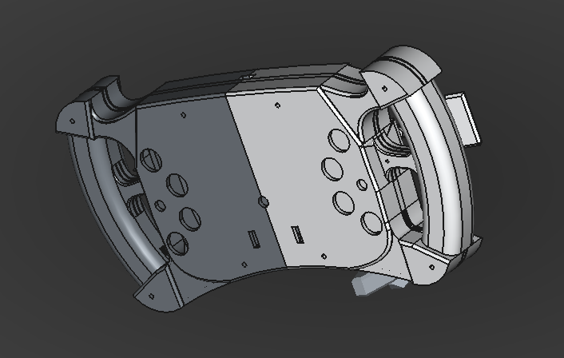
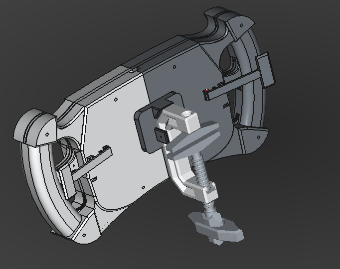

# ROTA_Pi

**ROTA_Pi** is a custom built sim race steering wheel powered by a **Raspberry Pi Pico**, designed for usability and ease of setup.  
It features all peripheral that is needed in sim racing (DRS, ADS, change gears, POV shift, and much more) and the additional paddle behind the wheel for both the throttle and braking without the need of external pads for it.

This project combines embedded hardware, custom 3D design, and custom styling all built from the ground up using custom PCBs, sensors system, and a 3D-printed enclosure modeled in **FreeCAD**.  
I also plan to add BMW M series badge at the middle of the wheel for accessories (not the real one of course and it isn’t there on the model yet). It connected via a USB-C to USB-B.

---

## Background

Lately, I started into cars stuff and that’s make me wanna play car game, like F1 25, Assetto Corsa, or even Forza Horizon.  
But my money is already used for buying laptop (duhh) so I couldn’t afford to buy dedicated race sim.  

Other than that, I also want a simple race sim without lots of setup and place taken. Because of that, I made this project that target usability.

I used pinhole in the PCB instead of direct of it, because it is easier to repair and fine tune.  
Also I print the PCB in my local shop because there’s MoQ JLCPCB and my PCB isn’t complex.

  

For the 3D model, I printed in **Filamen.com** of Indonesia, because there’s no #print-legion in Indonesia.

  

For the other parts I ordered from **Tokopedia** (an online marketplace in Indonesia), because Temu and Aliexpress can’t send to Indonesia.  
You can search the BOM for the total bill.

---

## 🔧 Specs

**Main process device:**  
- Raspberry Pi Pico (RP2040)

**Peripheral:**  
- Button: R13-507  
- Rotary Potentiometer: 10K ohm version  
- Rotary Encoder: EC-11  
- Hall sensor: SS49E  

**Other:**  
- Magnet: Neodymium 8x3mm  
- Display: 0.91" 128x32 OLED display  
- Power and data cable: Vention USB-C to USB-B

---

## Credits & Attribution

**Clamp model made by:** Studio Space Dust from Printables website  
- Webs: https://www.printables.com/model/730655-c-clamp-with-swappable-clamp-ends/files  
- License: Creative Commons Attribution-NonCommercial-ShareAlike 4.0 International (CC BY-NC-SA 4.0)  
  http://creativecommons.org/licenses/by-nc-sa/4.0/
